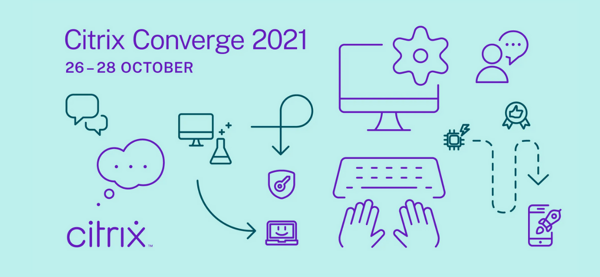

# Citrix Converge 2021


## Introduction
This repository contains the code samples that are presented by Eltjo van Gulik and Ryan Ververs-Bijkerk for the Citrix Converge presentation: Fight night: Scripting vs Programming

Based on the success of our previous [Converge session](https://youtu.be/98H6iS0EG4s) we will continue the fighting championship. But this fight night, the battle will rise to a whole new level, as it is between scripting vs programming.

This session will discuss the scripting and programming language titans of the automation world, PowerShell, Python, C# and GO. Citrix technology professionals Ryan Ververs-Bijkerk and Eltjo van Gulik demonstrate how these languages can be used to consume the Citrix APIs.

## Authentication
In order to communicate with the Citrix API, authentication is required. Please follow the instruction from the [Citrix Cloud API Overview](https://developer.cloud.com/citrix-cloud/citrix-cloud-api-overview/docs/get-started-with-citrix-cloud-apis) site.

The best practice is to use a vault solution, but for these examples, the variables need to be stored in the environment variables.

| Name | Value |
| :---  | :--- |
| Citirx_Client_Id | API access ID|
| Citrix _Client_Secret | APS access secret |
| Citrix_Customer_Id | Customer ID | 

## PowerShell
No special requirements.

## Python
Examples make use of the package request, use the ```pip install requests``` command to install the required package.

## GO
Compile the example using the ```go build filename``` command.

The notifications example requires the google uuid module which can be installed using the following command: ```go get github.com/google/uuid```
Before running ensure to run the following command to bypass the mod requirement: ```go env -w GO111MODULE=off```

## C#
Ensure to install the Newtonsoft.Json package using the package manager.

